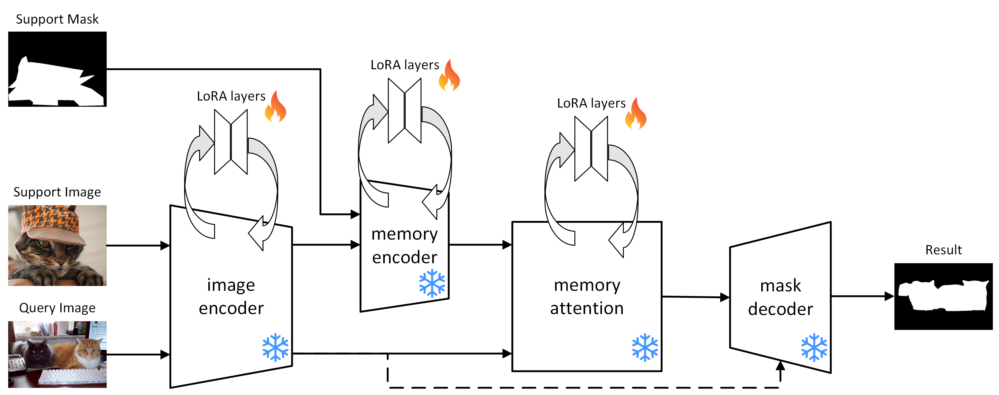
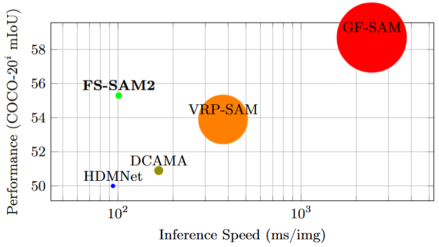
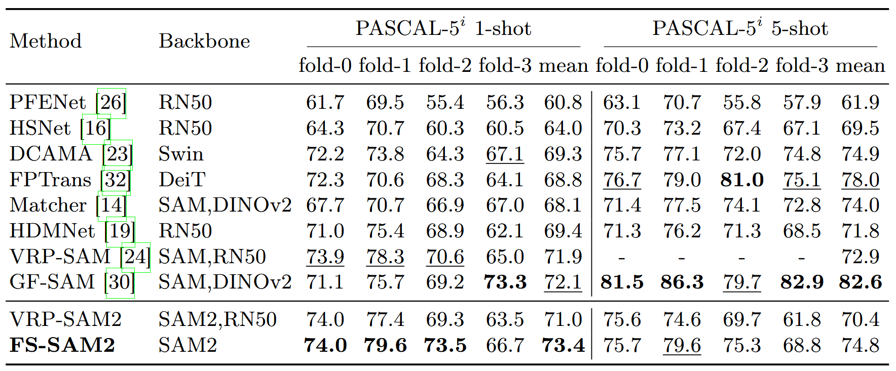
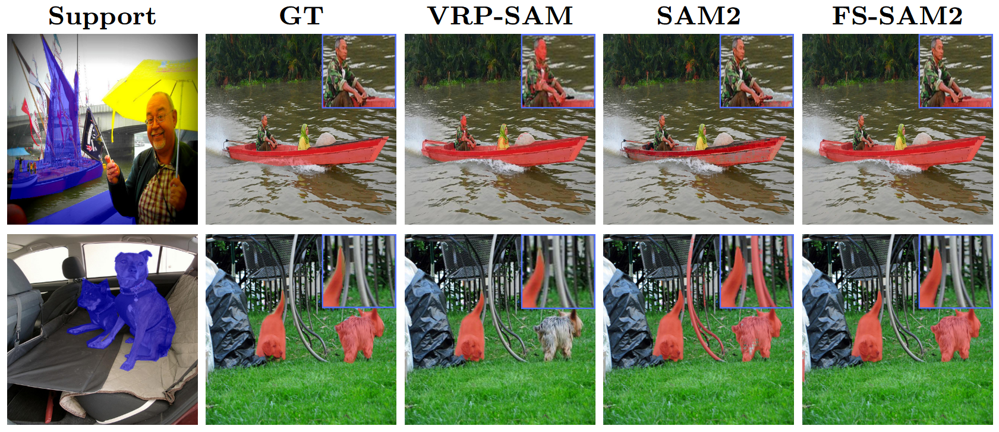

# FS-SAM2

This repository contains the official implementation of our [ICIAP 2025](https://sites.google.com/view/iciap25/home) paper, [*FS-SAM2: Adapting Segment Anything Model 2 for Few-Shot Semantic Segmentation via Low-Rank Adaptation*](https://arxiv.org/abs/2509.12105).


Authors: Bernardo Forni, Gabriele Lombardi, Federico Pozzi, Mirco Planamente.





## Results
Below are performance results for Few-Shot Semantic Segmentation (FSS) on the COCO-20<sup>i</sup> and PASCAL-5<sup>i</sup> datasets using mIoU metric, compared to other state-of-the-art models.

<p align="middle">
  
</p>





<!--
**Qualitative comparison results (1-shot):**


-->


## Installation
FS-SAM2 code requires `python>=3.12`, with `torch>=2.8.0` and `torchvision>=0.23.0`.
Use following instructions to download the code and create a virtual environment with PyTorch:
```bash
git clone https://github.com/fornib/FS-SAM2.git && cd FS-SAM2
python3.12 -m venv .venv
source .venv/bin/activate
pip3 install torch==2.8 torchvision==0.23 --index-url https://download.pytorch.org/whl/cu126
```

Install SAM2 and required dependencies:
```bash
cd segment-anything2/sam2
pip install -v -e .
cd ../..
pip install peft==0.17.1 tensorboardX==2.6
```


Download the SAM2.1-B+ model checkpoint:
```bash
wget -P checkpoint https://dl.fbaipublicfiles.com/segment_anything_2/092824/sam2.1_hiera_base_plus.pt
```


Follow [VRP-SAM instruction](https://github.com/syp2ysy/VRP-SAM?tab=readme-ov-file#preparing-few-shot-segmentation-datasets) for preparing Few-Shot Segmentation datasets: PASCAL-5<sup>i</sup> and COCO-20<sup>i</sup>.


## Usage
Training:
```bash
python3 -m torch.distributed.run --nproc_per_node=$GPUs$ train.py \
        --datapath $PATH_TO_YOUR_DATA$ \
        --benchmark {coco, pascal, fss} \
        --fold {0, 1, 2, 3} \
        --epochs 50 \
        --lr 1e-4 \
        --bsz 8    
```

Test a given training checkpoint:
<!-- Download trained models and put them under `logs/` folder. -->
```bash
python -m torch.distributed.run --nproc_per_node=$GPUs$ test.py \
    --datapath $PATH_TO_YOUR_DATA$ \
    --benchmark {coco, pascal, fss}  \
    --fold {0, 1, 2, 3}
    --logpath $PATH_TO_YOUR_MODEL$
```


## References
This project is mainly built based on [VRP-SAM](https://github.com/syp2ysy/VRP-SAM) and [PFENet](https://github.com/Jia-Research-Lab/PFENet).
Thanks for their great work!

<!--
## Citation
If you find this research useful, please consider citing:
```bibtex
```
-->


## License
Code is released for non-commercial and research purposes *only*.
For commercial purposes, please contact the authors.

